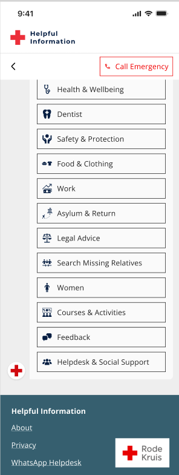

# Helpful Information as Aid - HIA Virtual Agent
The HIA virtual agent, or HIA, aims to make it easy, fast, and reliable to access information for people in vulnerable positions. It was created as an initial solution to Red Cross 510 team's challenge during the 48h Hackathon for Good.

# Demo
 

Including interface design - [Emergency response example](https://www.youtube.com/shorts/R8XbCnvsnAU)

All answers are a result of the multi-agent solution we created.

# Team 
- Tech Lead, [Camille Coeurjoly](https://github.com/Camille1992)
- Design Lead, [David Morales](https://www.linkedin.com/in/davidmdlr/)
- Infrastructure Lean, [Leo Stahlschmidt](https://github.com/pizzadizza)
- Operational Lead & Tech Support [Sabina Firtala](https://github.com/sabinagio)

# AI Solution
We propose a multi-agent solution built using `langgraph`:


### Query Understanding Agent
Pays attention to:
- initial language
- conversation tone: urgent and non-urgent
- query clarity. If a query is unclear, it will ask for clarification

### RAG agent
- It receives structured input from the query understanding agent.
- Uses ChromaDB as the vector store with Red Cross internal database, slightly tweaked (`data/Offers Clean.csv`)
- Enhances the search query with metadata (e.g. information category & subcategory, location address, opening hours, last update time, source, etc.)
- Calculates confidence and completeness scores based on search results

### Web agent
- When the RAG agent doesn't retrieve any information, it searches for information from trusted sources from different categories (e.g. `refugeehelp.nl`) to still find a useful answer.

### Response Quality agent
- Checks the response of the previous agents to see if it adheres to the guidelines provided by the Red Cross (`data/comms.json`)

# Deployment

## Online
We built the following infrastructure to allow for easy update and deployment of Red Cross resources. 

## Offline
Another solution that wasn't implemented yet was to create a mobile app that can run the chatbot both offline and online, as it will not rely on an internet connection to offer useful information. 

## Installation

1. To use the `src` modules, make sure to run this command in your conda environment:
```bash
pip install -e .
```

2. To load and re-load `src` modules into Jupyter notebooks, use the following commands at the top of the notebook:
```python
%load_ext autoreload
%autoreload 2
```
This will allow you to reload the Python scripts without restarting the Jupyter kernel.

## Tests

```
# start all tests
pytest tests/

# start a specific test
python -m pytest tests/test_query_understanding.py::test_clear_food_assistance_query -v
python -m pytest tests/test_rage.py::test_rag_handles_different_languages -v
```

# Project Presentation


## Pitch
Hi everyone! We are the R-accoon Squared team and today we’ll be talking about HIA, the tool we've created to help people find the help they need, exactly when they need it. But before we talk about her, I want you to imagine this.

You're a young mother, fleeing war to the Netherlands with your daughter. One day, she gets sick, and you're terrified because you don't speak Dutch, barely any English and you don't know where to turn because your family is far away. This is just one of countless situations where people desperately need help but don't know how to find it.

Right now, getting help often means endless phone lines, long office queues, and wrestling with complicated websites - all while dealing with a crisis. That's why we created HIA, your 24/7 pocket helper.

Let me show you how HIA works through a real example. Meet Olena from Ukraine. When her daughter got sick, she simply messaged HIA. Within seconds, HIA:
* Greeted her in Ukrainian
* Understood her request and immediately provided a step-by-step guide tailored to her needs
* She didn't use any complicated language, instead she focused on getting the most basic information to Olena, from documents she needed to places she could reach out
* And she did all of that in her native language!

But HIA doesn't stop at medical emergencies. Whether it's Maria needing food assistance, Ahmed looking for winter shelter, or Sarah seeking safety from the hands of abuse - HIA provides immediate, actionable help.

### What makes her special?
First off, she speaks multiple languages, which helps her connect with people in need - and she also understands context and sensitive situations. She is able to sense when someone is dealing with an emergency and is able to provide instant access to the most appropriate resource. She also provides verified and up-to-date information using Red Cross verified resources, so people do not waste their time seeking support when offices are closed.

### How does she do that?
We've built HIA by blending the expertise of all four of us and whilst she's not yet perfect, she does already:
* use the Red Cross database to extract and provide information
* she searches through verified websites to find more up-to-date information when her internal database is lacking
* have the infrastructure needed to be easily portable to any application, be it a Web-based Chatbot or a Telegram bot, depending on what is most easily accessible to people in need.
* have an easy to navigate and friendly interface, tailored to the Red Cross brand image
And this was the result of only 48h of work, which can already be used by the Red Cross to build upon and improve - which is all we could've hoped for to bring an immediate impact.

Although you've seen her being built like a chatbot, HIA is so much more than that - she's a bridge to hope, a trusted voice saying 'I understand, and I'm here to help' to anyone who needs support. Because everyone deserves to know where to find help when they need it most.
